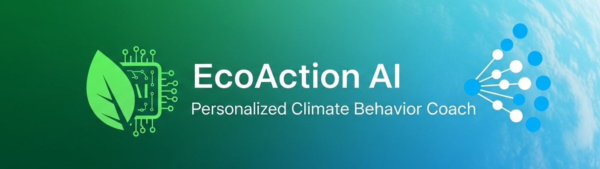

# 🌱 EcoAction AI

<p align="center">
   
</p>

<p align="center">
  <strong>Personalized AI-Powered Climate Action Platform</strong>
</p>

<p align="center">
  
  
  
  
</p>

---

## 🎯 What Does This App Do?

EcoAction AI transforms climate awareness into action through personalized sustainability coaching. Using advanced AI analysis, it calculates individual carbon footprints, identifies high-impact reduction opportunities, and delivers customized weekly challenges. The platform bridges the gap between environmental intention and measurable action through data-driven insights.

## 🔍 Why Was There a Need?

Most people want to help the environment but don't know where to start or which actions matter most. Generic sustainability advice wastes effort on low-impact activities while missing major reduction opportunities for each individual's unique lifestyle.

## 🤖 AI Agent Integration & LLM Architecture

EcoAction AI leverages a sophisticated three-agent system powered by GPT-4.1-nano through the AIML API, orchestrated via CrewAI framework:

**Agent 1 (Profiler):** Analyzes onboarding data to create enriched user profiles with psychographic insights, identifying personal motivations, barriers, and key carbon reduction levers tailored to individual lifestyles.

**Agent 2 (Analyst):** Performs quantitative carbon footprint analysis using emission factors, validates reduction opportunities, and generates personalized insights that connect emissions data with user psychology for maximum behavioral impact.

**Agent 3 (Planner):** Creates actionable weekly sustainability challenges combining daily habits with long-term goals, adapting recommendations based on user progress and maintaining engagement through personalized coaching.

Each agent uses structured JSON outputs with Pydantic validation, ensuring data integrity and seamless workflow integration for reliable, scalable AI-driven sustainability guidance.

## 🛠️ Tech Stack

### **Core Framework**
- **Frontend:** Streamlit 1.48+ (Interactive web interface)
- **Backend:** Python 3.10 with FastAPI
- **Database:** Supabase (PostgreSQL with real-time capabilities)
- **Authentication:** Supabase Auth with secure session management

### **AI & Machine Learning**
- **LLM Provider:** AIML API (GPT-4.1-nano)
- **Agent Framework:** CrewAI 0.159+ (Multi-agent orchestration)
- **Data Validation:** Pydantic 2.0+ (Structured outputs)
- **Carbon Analysis:** Custom emission factor calculations

### **Development & Deployment**
- **Package Manager:** UV (Ultra-fast Python package manager)
- **Environment Management:** Python virtual environments
- **Testing:** Pytest with async support
- **Code Quality:** Black, Ruff, MyPy, Bandit
- **Version Control:** Git with structured workflows

### **Key Dependencies**
```python
streamlit>=1.48.1          # Web interface
crewai>=0.159.0           # AI agent framework
supabase>=2.18.1          # Database & auth
pydantic>=2.0.0           # Data validation
openai>=1.100.2           # LLM integration
pandas>=2.3.1             # Data analysis
```

## 📂 Current File Structure

```
ecoaction_ai_v01/
├── app.py                     # Main Streamlit application
├── pyproject.toml            # Project dependencies & config
├── uv.lock                   # Dependency lock file
├── README.md                 # Project documentation
├── .env                      # Environment variables (not in repo)
│
├── agent/                    # AI Agent System
│   ├── __init__.py
│   ├── agents.py            # Agent definitions (Profiler, Analyst, Planner)
│   ├── crew.py              # Agent workflow orchestration
│   ├── tasks.py             # Task definitions for each agent
│   ├── models.py            # Pydantic models for data validation
│   ├── utils.py             # Agent utility tools
│   └── __pycache__/         # Python cache files
│
├── data_model/              # Database & Authentication
│   ├── __init__.py
│   ├── auth.py              # User authentication logic
│   ├── database.py          # Database operations & queries
│   ├── supabase_client.py   # Supabase client configuration
│   └── __pycache__/         # Python cache files
│
├── pages/                   # Streamlit Multi-page App
│   ├── 1_auth.py           # Authentication & user management
│   ├── 2_onboarding.py     # User profiling & agent workflows
│   ├── 3_dashboard.py      # Results display & progress tracking
│   └── 4_score_calculated.py # Carbon footprint visualization
│
├── tests/                   # Testing Suite
│   ├── __init__.py
│   ├── test_agent_2.py     # Agent 2 (Analyst) tests
│   ├── test_onboarding_flow.py # User flow tests
│   ├── run_agent_2.py      # Agent execution scripts
│   └── run_agent_3.py      # Agent testing utilities
│
├── research_notebooks/      # Development & Research
│   └── nb_1.ipynb          # Analysis notebooks
│
├── images/                  # Static Assets
│   ├── cover_image_1.jpg    # App branding images
│   └── cover_image_2.jpg
│
├── experimentation/         # Development experiments
│
└── .venv/                   # Virtual environment (local)
```

## 🌍 Impact Potential

EcoAction AI moves sustainability from awareness to action through data-driven, personalized guidance:

- **🎯 Efficiency:** Directs user effort to changes with the highest marginal impact, preventing wasted effort on low-value actions through AI-powered prioritization.

- **🌐 Democratization:** Makes complex carbon footprint data understandable and actionable for anyone, not just sustainability experts, breaking down barriers to climate action.

- **📈 Scalability:** The AI coach can support millions of users simultaneously, offering a scalable model for behavioral change without human intervention limitations.

- **📊 Quantifiable Impact:** Aggregates reduced emissions across the user base, providing concrete measurement of positive environmental contribution with real-time impact tracking.

- **🔄 Behavioral Change:** Transforms one-time awareness into sustained action through personalized weekly challenges and continuous AI-driven adaptation.

- **💡 Smart Prioritization:** Uses individual lifestyle analysis to identify the most impactful changes specific to each user's circumstances and capabilities.

---

## 🚀 Installation & Setup

### Prerequisites
- Python 3.10
- UV package manager (recommended) or pip
- Supabase account
- AIML API key

### Windows Setup

1. **Clone the repository:**
   ```cmd
   git clone https://github.com/yourusername/ecoaction_ai_v01.git
   cd ecoaction_ai_v01
   ```

2. **Install UV package manager:**
   ```cmd
   pip install uv
   ```

3. **Create virtual environment and install dependencies:**
   ```cmd
   uv venv
   .venv\Scripts\activate
   uv sync
   ```

4. **Set up environment variables:**
   ```cmd
   copy .env.example .env
   ```
   Edit `.env` file with your API keys:
   ```
   AI_ML_API_KEY=your_aiml_api_key_here
   SUPABASE_URL=your_supabase_url
   SUPABASE_KEY=your_supabase_anon_key
   ```

5. **Run the application:**
   ```cmd
   streamlit run app.py
   ```

### macOS Setup

1. **Clone the repository:**
   ```bash
   git clone https://github.com/yourusername/ecoaction_ai_v01.git
   cd ecoaction_ai_v01
   ```

2. **Install UV package manager:**
   ```bash
   pip install uv
   ```

3. **Create virtual environment and install dependencies:**
   ```bash
   uv venv
   source .venv/bin/activate
   uv sync
   ```

4. **Set up environment variables:**
   ```bash
   cp .env.example .env
   ```
   Edit `.env` file with your API keys:
   ```
   AI_ML_API_KEY=your_aiml_api_key_here
   SUPABASE_URL=your_supabase_url
   SUPABASE_KEY=your_supabase_anon_key
   ```

5. **Run the application:**
   ```bash
   streamlit run app.py
   ```

### Linux Setup

1. **Clone the repository:**
   ```bash
   git clone https://github.com/yourusername/ecoaction_ai_v01.git
   cd ecoaction_ai_v01
   ```

2. **Install UV package manager:**
   ```bash
   pip install uv
   ```

3. **Create virtual environment and install dependencies:**
   ```bash
   uv venv
   source .venv/bin/activate
   uv sync
   ```

4. **Set up environment variables:**
   ```bash
   cp .env.example .env
   ```
   Edit `.env` file with your API keys:
   ```
   AI_ML_API_KEY=your_aiml_api_key_here
   SUPABASE_URL=your_supabase_url
   SUPABASE_KEY=your_supabase_anon_key
   ```

5. **Run the application:**
   ```bash
   streamlit run app.py
   ```

### Alternative Installation (Without UV)

If you prefer using pip:

```bash
# Create virtual environment
python -m venv .venv

# Activate virtual environment
# Windows:
.venv\Scripts\activate
# macOS/Linux:
source .venv/bin/activate

# Install dependencies
pip install -r requirements.txt  # Generate from pyproject.toml if needed
```

---

## 🧪 Testing

Run the test suite:
```bash
# Activate virtual environment first
pytest tests/

# Run specific agent tests
python tests/test_agent_2.py
python tests/test_onboarding_flow.py
```

## 📖 Usage

1. **Authentication:** Sign up or log in through the authentication page
2. **Onboarding:** Complete the sustainability profile questionnaire
3. **AI Analysis:** Let the three AI agents analyze your data:
   - Agent 1 creates your enriched profile
   - Agent 2 calculates your carbon footprint
   - Agent 3 generates personalized action plans
4. **Dashboard:** View your results, track progress, and access weekly challenges

## 🤝 Contributing

1. Fork the repository
2. Create a feature branch (`git checkout -b feature/amazing-feature`)
3. Commit your changes (`git commit -m 'Add amazing feature'`)
4. Push to the branch (`git push origin feature/amazing-feature`)
5. Open a Pull Request

## 📄 License

This project is licensed under the MIT License - see the [LICENSE](LICENSE) file for details.

## 🌟 Acknowledgments

- CrewAI for the multi-agent framework
- Supabase for the backend infrastructure
- Streamlit for the web interface
- AIML API for LLM capabilities

---

<p align="center">
  <strong>🌱 Making sustainability personal, actionable, and impactful</strong>
</p>

### Features

- **Authentication**: Secure user authentication with Supabase Auth
- **Dashboard**: Personalized dashboard with action recommendations
- **Progress Tracking**: Track CO2 savings and environmental impact
- **Weekly Reports**: Detailed weekly sustainability reports
- **Community Challenges**: Participate in community sustainability challenges

### Setup and Running the Project on macOS

#### 1. Prerequisites

First, ensure you have Python 3.10+ and `uv` (a Python package manager) installed.

```sh
# Install Python 3.10+ via Homebrew if you don't have it
brew install python

# Install uv
pip install uv
```

#### 2. Project Setup

Navigate to your project directory in the terminal and create a virtual environment, then install the required dependencies.

```sh
# Create a virtual environment
uv venv

# Activate the virtual environment
source .venv/bin/activate

# Install dependencies from pyproject.toml
uv sync
```

#### 3. Configure Environment Variables

Your application requires API keys for Supabase and an AI service. Create a `.env` file in the root of your project directory.

```
SUPABASE_URL="your_supabase_url_here"
SUPABASE_KEY="your_supabase_anon_key_here"
AI_ML_API_KEY="your_aiml_api_key_here"
```

You will need to get these credentials from your Supabase project settings and the AI/ML API provider you are using.

#### 4. Set Up the Database

The application uses Supabase for the backend. You will need to:
1.  Create a project on [Supabase](https://supabase.com/).
2.  Use the SQL scripts in your `data_model` directory, like `data_model/sql_scripts_1.sql`, to set up the necessary tables (e.g., `users`) in the Supabase SQL Editor.

#### 5. Run the Application

Once the setup is complete, you can run the Streamlit application.

```sh
streamlit run app.py
```

This will start the web server, and you can access the application in your browser at the local URL provided in the terminal output.
